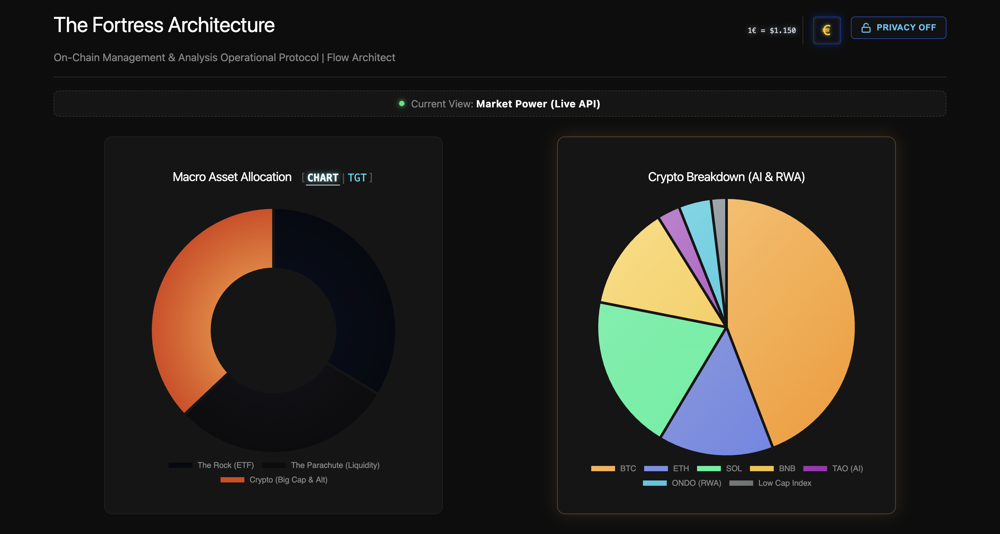

# 🏰 The Fortress (La Fortezza)
**Operational Terminal for On-Chain Forensics, DeFi Tracking, and Dynamic Asset Allocation.**

*Built with AI as a cognitive exoskeleton. Driven by Behavioral Pattern Recognition.*

  
*(Replace with your actual screenshot file in the repo for a visual preview.)*

---

## 👁️ Vision & Philosophy
This terminal is not just a portfolio tracker; it is the quantitative extraction of a behavioral framework. 

Markets are not just numbers; they are psychology translated into flows. The core philosophy behind this architecture is that **analytical sensitivity is an edge**. Human behavioral patterns work similarly to the **Tornado Cash** protocol: the output is visible and powerful, but the internal routing is impossible to trace and judge from the outside. 

This terminal is built to decode those on-chain flows and manage exposure dynamically.

## ⚙️ Core Features
- **Dual-State Engine**: Instant toggle between **Base Cost (Zero Points)** and **Live Market Power** (powered by CoinGecko API & Yahoo Finance fallback).
- **Macro Target Radar**: Real-time tracking of the 33/33/33 architectural split (TradFi ETF / Liquidity Parachute / Crypto Big Caps).
- **DeFi Collateral Matrix**: Granular monitoring of capital efficiency, tracking LTV (Loan-to-Value), active leverage (currently averaging 3.9x), and smart contract health bars.
- **Institutional OpSec**: "Privacy Blur" toggle to instantly mask sensitive capital amounts while keeping percentages and architecture visible.
- **Hidden Admin Terminal**: Accessible only via Konami Code (`Up, Up, Down, Down`) for manual synchronization and data injection via LocalStorage.

## 🛠️ Technical Stack
- **Frontend**: Vanilla HTML5, CSS3, JavaScript (ES6+). No heavy frameworks, purely optimized for speed and fluidity.
- **Visualization**: Chart.js for responsive, glowing, and interactive data layers.
- **Data Feeds**: Asynchronous API integration (CoinGecko for Web3, Yahoo Finance for TradFi via proxy).

## Quick Start
1. Clone the repo: `git clone [repo-link]`
2. Open `index.html` in your browser.
3. Explore the dashboard: Toggle views, activate Privacy Blur, and use Konami Code for the admin terminal.

## ⚠️ Disclaimer (OpSec)
*The values, wallet addresses, and capital amounts shown in the live demo/screenshots are heavily altered or injected with dummy data for OpSec and privacy reasons. The underlying logic, the LTV algorithms, and the portfolio percentages are entirely authentic.*

---
**Building in Public.** Feedback from other builders, on-chain analysts, and reasoning engineers is always welcome.

Follow me on X: [@alex_lamports](https://x.com/alex_lamports)

## License
MIT License – Feel free to fork, modify, and build upon this.
